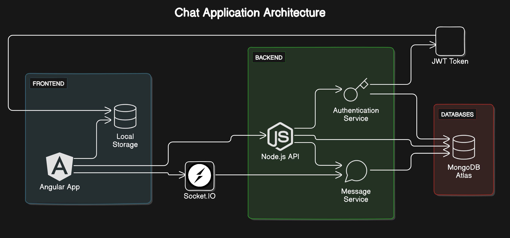

# Chat Application Chatty

This is a real-time chat application built using Angular for the frontend, Node.js for the backend, Socket.IO for real-time communication, and MongoDB Atlas for the database.

## Table of Contents

- [Architecture](#Architecture)
- [Features](#features)
- [Technologies](#technologies)
- [Setup](#setup)
- [Usage](#usage)
- [Contributing](#contributing)
- [License](#license)

## Architecture

The application architecture consists of three main parts:

1. **Frontend (Angular App)**:
   - The user interface of the chat application.
   - Manages user sessions using local storage.
   - Communicates with the backend via Socket.IO for real-time updates and HTTP requests for other interactions.

2. **Backend (Node.js API)**:
   - Handles client requests and manages authentication and message services.
   - Communicates with the frontend using Socket.IO and JWT tokens for secure data transmission.
   - Interacts with the MongoDB Atlas database to store and retrieve data.

3. **Database (MongoDB Atlas)**:
   - A cloud-based NoSQL database to store user information and chat messages.



## Features

- **Real-Time Messaging**: Instant messaging with Socket.IO for real-time communication.
- **User Authentication**: Secure login and registration using JWT tokens.
- **Persistent Storage**: Messages and user data are stored in MongoDB Atlas.

## Technologies

- **Frontend**: Angular, Socket.IO-client
- **Backend**: Node.js, Express.js, Socket.IO, JWT
- **Database**: MongoDB Atlas

## Setup

### Prerequisites

- Node.js
- Angular CLI
- MongoDB Atlas account

### Installation

1. Clone the repository:

   ```bash
   git clone https://github.com/your-username/chat-application.git
   cd chat-application

### Contributing
Contributions are welcome! Please fork the repository and create a pull request with your changes.

### Additional Notes

- Make sure to replace placeholders like `path/to/architecture-diagram.png` and `your-username` with actual values.
- Ensure the `.env` file is properly configured with your MongoDB URI and JWT secret.

## Authors

- [@sugata2002](https://www.github.com/sugata2002)

